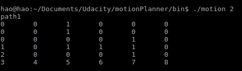
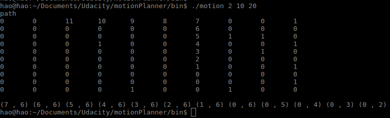

# Motion-Planner

This project use to class MotionPlannerRandom and MotionPlannerOptimal to implement motion planner. We assume each time
we move 1 grid, and the cost is 1. The code is written with C++11, and the project is built with CMake. 
The structure:

## Compile
Go to the project.
```
  mkdir build
  cmake ..
  make
```

## Execution
Then we get a executable file named motion in bin. For this file, we have two ways for running. The first one is:
```
  ./motion <1 or 2>
```
where 1 means we choose  MotionPlannerRandom and 2 means we choose MotionPlannerOptimal. In this situation, I have set 7 groups fixed data for test, including the case of general test case, the 3th column are all 1 that the we can never reach the goal, the 5th row are all 1 that the we can never reach the goal, the start point is 1, the goal is 1, the goal and start point are in same position, and the world state is empty.  
As the figure shows below, we use a 2D vector shows the details of the path in this situation.


The second one is 
```
  ./motion <1 or 2> <world size> <max step number>
```
In this situation, there are 3 parameters: approach choice, world size, max step number, so that the code will generate a world state randomly, and if MotionPlannerRandom is chosen, the parameter maxStepNumber will be used.


## Analysis
I used parent class MotionPlanner to set the sturcture. And build two subclass MotionPlannerRandom and MotionPlannerOptimal to implement the function which is required. 
In MotionPlannerRandom, I check some corner cases(the robotPose and goalPose are assumed valid), a set is used for the function "never attempt to visit a cell that was visited in the last ​ sqrt(max_step_number)​ steps", before the code reachs max_step_number or goal, runs in loop. In each loop, the first task is to check how many valid directions we can go in current potion(0-4), if there is no direction to go, we fail, just break. Then we should check whether these directions in the never attempt set, if so, erase them. If there is no direction after erase, we choose the last direction to go. Then we go forward randomly. The time cost in each loop is constant, so the whole time cost is the length of loop. The worst one is:
```
  T(n) = max_step_number_
```
And as the experiment results showed, it was easy to fail in this approach. 

The memory cost is the same of world state.

In MotionPlannerOptimal, the key idea is that we keep 3 parameters in each cell: F, G, H. G means the minimum steps to reach this cell from start point, H means the minimum steps to reach goal from this cell, and F is the sum of G and H. Every time we find new cell, we update their parameters. Because the approach is A*, so In the worst case A* time complexity is exponential.

The other choice is Q-learning. 


