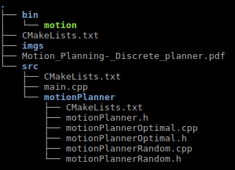

# Motion-Planner

This project use to class MotionPlannerRandom and MotionPlannerOptimal to implement motion planner. We assume each time
we move 1 grid, and the cost is 1. The code is written with C++11, and the project is built with CMake. 
The structure:

## compile
Go to the project.
```
  mkdir build
  cmake ..
  make
```
Then we get a executable file named motion in bin. For this file, we have two ways for running. The first one is:
```
  ./motion (1 or 2)
```


